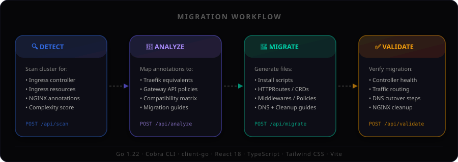

<p align="center">
  
</p>

<p align="center">
  <strong>Kubernetes Ingress Migration Tool</strong> — Scan, analyze, and migrate from Ingress NGINX to <strong>Traefik v3</strong> or <strong>Gateway API (Envoy Gateway)</strong> with zero downtime.
</p>

<p align="center">
  
  
  
  
</p>

---

## Why kube-migrate?

With the [NGINX Ingress Controller sunset](https://kubernetes.io/blog/2025/01/07/ingress-nginx-end-of-an-era/), teams need to migrate to a supported controller. `kube-migrate` automates the 4-step workflow:

<p align="center">
  
</p>

1. **🔍 Detect** — Scan your cluster for the ingress controller and all Ingress resources
2. **🔬 Analyze** — Map every NGINX annotation to its equivalent in the target controller
3. **🚀 Migrate** — Generate numbered, step-by-step YAML manifests for a safe parallel migration
4. **✅ Validate** — Verify the new controller is serving traffic correctly

## Features

- **50+ NGINX annotation mappings** for both Traefik and Gateway API
- **Zero-downtime migration** — new controller runs alongside NGINX until DNS cutover
- **CLI + Web UI** — use the command line or the interactive React dashboard
- **Smart complexity scoring** — ingresses are rated simple/moderate/complex
- **Full file generation** — install scripts, middlewares/policies, updated ingresses/HTTPRoutes, verify scripts, DNS guide, cleanup scripts
- **Migration report** — markdown report summarizing the migration plan

## Quick Start

### Install

```bash
# From source
make build

# Docker
docker build -t kube-migrate .
docker run --rm -v ~/.kube:/root/.kube kube-migrate scan
```

### Build

```bash
# Build everything (UI + Go binary)
make build

# Or build separately
make build-ui    # Builds React frontend
make build-go    # Builds Go binary with embedded UI
```

### Usage

```bash
# Scan cluster for all ingresses
kube-migrate scan

# Analyze compatibility with Traefik
kube-migrate analyze --target traefik

# Analyze compatibility with Gateway API
kube-migrate analyze --target gateway-api

# Generate migration files for Traefik
kube-migrate migrate --target traefik --output-dir ./migration

# Generate migration files for Gateway API (Envoy Gateway)
kube-migrate migrate --target gateway-api --output-dir ./migration

# Open the visual migration dashboard
kube-migrate ui
```

### Web UI

```bash
# Start the UI server on port 8080
kube-migrate ui

# Custom port
kube-migrate ui --port 3000
```

The UI provides an interactive 4-step wizard with:
- Cluster scanning with ingress resource table
- Annotation compatibility matrix with filtering + expand/collapse (✅⚠️❌)
- Dependency graph showing host clusters and shared annotation patterns
- File generation with categorized file viewer
- Per-step dry-run & apply buttons (kubectl apply from the UI)
- Download all migration files as a ZIP
- Migration gaps view highlighting unsupported and workaround annotations
- Migration validation with phase detection and next-step recommendations

## Architecture

```
kube-migrate
├── cmd/                        # Cobra CLI commands
│   ├── root.go                 # Root command + global flags
│   ├── scan.go                 # Scan cluster
│   ├── analyze.go              # Analyze compatibility
│   ├── migrate.go              # Generate migration files
│   └── ui.go                   # Start web UI server
├── pkg/
│   ├── scanner/                # Kubernetes cluster scanning
│   │   ├── scanner.go          # Core scanning logic
│   │   ├── controller.go       # Controller detection
│   │   ├── config.go           # Configuration loading
│   │   └── types.go            # Data types
│   ├── analyzer/               # Annotation compatibility mapping
│   │   ├── analyzer.go         # Analysis engine
│   │   └── compatibility.go    # 50+ annotation mappings
│   ├── migrator/
│   │   ├── types.go            # Migrator interface
│   │   ├── traefik/            # Traefik migration generation
│   │   │   └── migrator.go     # Generates Middleware CRDs + updated Ingresses
│   │   └── gatewayapi/         # Gateway API migration generation
│   │       └── migrator.go     # Generates GatewayClass/Gateway/HTTPRoutes/Policies
│   ├── generator/              # Output file writing
│   │   └── output.go           # Write files + markdown report
│   └── server/                 # HTTP API server + embedded React UI
│       ├── server.go           # REST API handlers
│       ├── guides.go           # Annotation migration guides
│       ├── validate.go         # Migration validation logic
│       └── dist/               # Embedded React build output
├── web/                        # React 18 + TypeScript + Tailwind CSS
│   ├── src/
│   │   ├── App.tsx             # Main app with sidebar navigation
│   │   ├── pages/              # 4 page components
│   │   ├── components/         # Shared components (FileViewer, AnnotationMatrix, DependencyGraph, MigrationGaps)
│   │   ├── types/              # TypeScript type definitions
│   │   └── api/                # API client
│   └── vite.config.ts          # Vite build config
├── examples/                   # Sample NGINX Ingress YAML files
├── main.go                     # Entry point
├── go.mod                      # Go module
└── Makefile                    # Build targets
```

## Migration Targets

### Traefik v3

Generates:
- Helm install scripts + values.yaml
- Middleware CRDs (rate-limit, IP allowlist, forward auth, CORS, SSL redirect)
- Updated Ingress resources with `ingressClassName: traefik`
- Verification script
- DNS migration guide
- Cleanup script

### Gateway API (Envoy Gateway)

Generates:
- Gateway API CRD install
- Envoy Gateway Helm install + values.yaml
- GatewayClass + Gateway (with per-host HTTPS listeners)
- HTTPRoutes (with HTTP→HTTPS redirect routes)
- BackendTrafficPolicy (rate-limit, timeouts)
- SecurityPolicy (ext-auth)
- Verification script
- Cleanup script

## Annotation Coverage

| Category | Annotations | Traefik | Gateway API |
|----------|------------|---------|-------------|
| SSL/TLS | ssl-redirect, force-ssl-redirect, ssl-passthrough | ✅ | ✅ |
| Authentication | auth-url, auth-signin, auth-response-headers, auth-type, auth-secret | ✅ | ✅ |
| Rate Limiting | limit-rps, limit-rpm, limit-connections | ✅ | ✅ |
| CORS | enable-cors, cors-allow-origin, cors-allow-methods, cors-allow-headers | ✅ | ⚠️ |
| IP Filtering | whitelist-source-range | ✅ | ✅ |
| URL Rewriting | rewrite-target, use-regex | ✅ | ✅ |
| Timeouts | proxy-read-timeout, proxy-send-timeout, proxy-connect-timeout | ✅ | ✅ |
| Session Affinity | affinity, session-cookie-name | ✅ | ✅ |
| WebSocket | websocket-services, proxy-http-version | ✅ | ✅ |
| Body Size | proxy-body-size, client-body-buffer-size | ✅ | ✅ |
| Custom Headers | custom-http-errors, server-snippet, configuration-snippet | ⚠️ | ❌ |
| Canary | canary, canary-weight, canary-header | ⚠️ | ⚠️ |

## Development

```bash
# Frontend dev server (hot reload)
make dev-ui

# Run Go tests
make test

# Run full build
make build
```

## Examples

The `examples/` directory contains 11 production-realistic NGINX Ingress YAML files covering:
- Basic routing
- TLS termination
- Rate limiting + IP allowlist
- OAuth2 / external authentication
- URL rewriting
- CORS
- WebSocket
- gRPC
- Canary deployments
- Session affinity
- Full-featured (all annotations combined)

## Configuration

Create a `.kube-migrate.yaml` in your project root (see `.kube-migrate.yaml.example`):

```yaml
target: gateway-api
outputDir: ./migration
namespace: ""
ignoreAnnotations:
  - "custom-internal-annotation"
```

## License

MIT
